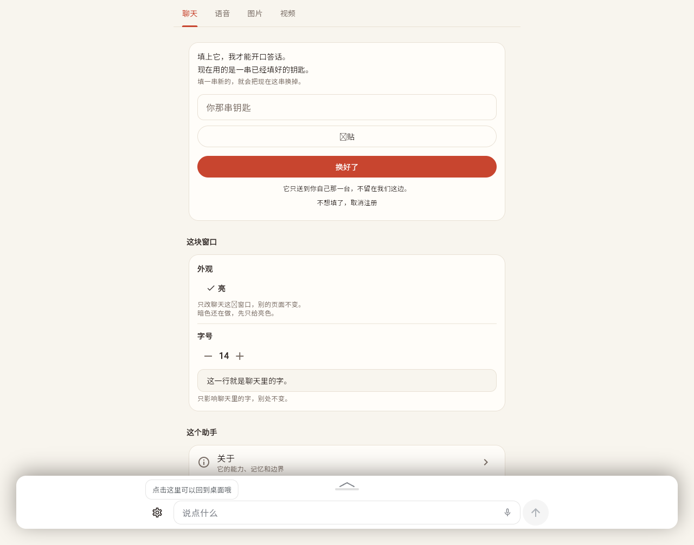

# 126 · 小程序容器：**顶栏与返回箭头撤掉** ＋ 聊天条那颗 home（点它回桌面）

> **主人 2026-09-27 原话**（一段话里三件）：
> *「那个我的小程序不需要 header 和箭头返回，把那一个东西去掉，
> 然后让我的聊天窗口那边左侧的那个 home 按钮扩大一些，
> 然后点击 home 就是回到桌面，点击 home 回到桌面。
> 然后用户可以收到提醒，就是进入小程序以后点击 home 那个 home 那个 icon 上面
> 会有一个浮窗，就是大概停留 3~4 秒钟，就是说点击这里可以回到桌面哦，这样」*
>
> 这一份说清：**屏幕上变成什么样** · **出口搬到哪** · **那条浮窗的规矩** ·
> **顺手修掉的那个真缺陷** · **判据** · **哪些没验到**。

---

## 一、三件事（一处一行）

| # | 做什么 | 落点 |
|---|---|---|
| ① | **容器那条顶栏整条撤掉**（返回箭头 ＋ 标题 ＋ 分隔线）—— 不是藏起来，**一个像素都不占** | `v2/apps/mobile/lib/widgets/mini_app_host.dart` |
| ② | **聊天条最前面那颗 home 变成按钮**：图形 18 → **22**，命中区撑到 **≥44**（D3.6）；点它 = **回桌面** | `v2/apps/mobile/lib/screens/chat_screen.dart` 的 `_homeButton` / `_backToDesktop` |
| ③ | **进小程序时那条浮窗**：`点击这里可以回到桌面哦`，**3.5 秒**后自己走，浮在**那一行上面**、不占排版、不吃点击 | `chat_screen.dart` 的 `_homeHintBubble` ＋ `widgets/composer.dart` 的 `hintAbove` |

⚠️ **"顶栏撤掉"是撤整个容器的**（不只"我的小程序"）：内置那三屏（设置 / 发现 /「我自己那台」）
走的是**同一个容器** ⇒ 它们的抬头条（「← 配置」「← 发现」…）**也一起没了**。
理由是同一件事：出口现在只有一条（那颗 home），留着两条出口迟早说两种话。
👉 **要只给内置那三屏留着抬头** ⇒ 说一声，这一刀再分一次（判据里那条"顶栏不许在"就要跟着分）。

### 1.1 那颗 home **什么时候都有事干**（不是一颗空按钮）

| 现在在哪 | 按下去 |
|---|---|
| 开着某个小程序 / 内置屏 | **关掉这一屏**（收 harness · 回主线那一间 `main` · 收回动效）**＋ 把聊天收起来** |
| 在桌面上、聊天是展开的 | **把聊天收起来**（桌面才露得出来） |
| 在桌面上、聊天本来就收着 | 什么都不用做（它已经是"回到桌面"了 —— 这时按一下不产生任何变化） |

⚠️ **图形规则一个字没改**（主人 2026-09-23 定的那条）：桌面上是**家**，
进了某个小程序就是**它自己的图标**（`_scopeIcon`，与桌面上那一格**同一个来源**）。
他这次说的是"**那颗按钮**"（位置、大小、作用），不是"把图形换成房子"。

---

## 二、那条浮窗的六条规矩

| # | 规矩 | 为什么 |
|---|---|---|
| 1 | **进屏才出现**（点开图标、或助手做完自动打开那一趟），桌面上一个像素都不许有 | 它说的是"怎么出去" —— 在桌面上那句话是**假话** |
| 2 | **3.5 秒自己走**（`homeHintFor`，主人说"3~4 秒"取中间） | 它是一句说明，不是待办：不该要他点、也不该一直杵着 |
| 3 | **浮在那一行上面**（锚点 = 那颗 home 的上面），**不占排版** | `Positioned(top: 0)` ＋ `FractionalTranslation(0,-1)`：它的**下沿贴住那一行的上沿**（不用知道那一行多高 —— 写死一个数就错）。出现/消失**不会**让浮窗长高再缩回去（D4.8） |
| 4 | **`IgnorePointer`**：它不吃点击 | 它是"说一句话"，不许挡住他点底下的东西（与 `plan_strip` 同一条） |
| 5 | **他真按了 home ⇒ 立刻收** | 话已经说到了，没必要再留 3.5 秒 |
| 6 | **再进一次会重新计一遍**（不是"一辈子只看一次"） | 他这次进的是**另一个**小程序 |

⚠️ **文字只住一处**：`models/space_words.dart` 的 `homeHintWords`，
而且进**禁用词扫描**（`test/unit/forbidden_words_test.dart` 的名单里逐字引它）。

---

## 三、🔴 顺手修掉的一个真缺陷（撤顶栏**露出**来的）

把顶栏撤掉之后，`test/widget/mini_app_test.dart` 里三条"聊天展开再收起"的判据
当场红成 **`RenderFlex overflowed by 20 pixels`**（设置页那条 `TabBar` 50 高，被塞进 30 高的盒子里）。

**根因不是新代码，是旧布局一直有的时序问题**（以前被顶栏**挡住看不见**）：

```
收起聊天的那一帧：`_floaterH` 还是**展开时**的高度（~540）
  ⇒ 小程序内容的内缩 = 边距 + 540 ≈ 554
  ⇒ 页面只剩 600 − 554 = 30 像素
```

- 旧布局：那条抬头（~51）先把这点高度吃掉 ⇒ 内容分到 **0** ⇒ 被裁没（**看不出问题 ≠ 没问题**）；
- 新布局（没抬头了）：页面真的拿到 **30** ⇒ `TabBar` 当场溢出。

**修法（两处，都在容器里）**：

1. **内缩认"落定"的那一档**（`_inset`）：正在收放动画、或者档位刚变的那一帧**先沿用上一次落定的值**
   —— "收起来之后浮窗有多高"本来就是个**落定的量**；
2. **页面按"屏幕那么大"排版**：`Expanded` 里加一层 `OverflowBox`
   （min/max = 屏幕尺寸），真正的高度由 `Padding(bottom: _inset)` 决定
   —— 外面那个框只负责**露多少**（这正是"从图标扩开"那套动画的本意）。

⇒ 页面高度在整个开/关动画里**恒定**（= 屏幕 − 落定内缩），外面那个框只负责裁剪。

---

### 三·补、线上实拍



（2026-09-27 部署后在真页面上拍的：设置那一屏**直接从 tab 开始**（原来上面那条「← 配置」没了），
输入条最前面那颗 icon 上面浮着「点击这里可以回到桌面哦」。）

---

## 四、判据

| 在哪 | 钉住了什么 |
|---|---|
| 新 `v2/apps/mobile/test/widget/home_button_test.dart` **6 条** | ① **进小程序时顶栏与箭头也不在**（`miniAppBack` 那个字、`Icons.arrow_back` 都不许有）· ② **命中区 ≥44**（两颗方向的实测）· ③ **进屏就有那条浮窗**（逐字）＋ **负向对照**（桌面上一个字都没有）＋ **贴住那颗 icon 的上沿**＋ **3.5 秒后自己走**（差 0.8 秒时还在、再过 0.9 秒没了）· ④ **点它 = 回桌面**（那一屏关掉 ＋ 回主线 ＋ 聊天收起来 ＋ 提示收掉）· ⑤ **桌面上按它照样有结果**（把展开的聊天收起来 —— 不是空按钮）· ⑥ **那条提示外面包着 `IgnorePointer`**（不吃点击） |
| `test/widget/mini_app_test.dart`（**改**） | 原来那五处 `find.byTooltip(miniAppBack)`（"从容器顶上那个返回关掉它"）改成**点那颗 home**；另加"顶栏与箭头一个都不许在"的正向对照 |
| `test/widget/accessibility_test.dart`（**硬闸**） | 顺便扫到那颗新按钮（命中区 ≥44）；小程序那一屏在五档字号下不溢出 |
| `test/unit/forbidden_words_test.dart` | `homeHintWords` 进扫描名单（逐字引数据源） |

**跑法**（`v2/apps/mobile` 下）：

```bash
~/sdk/flutter/bin/flutter analyze
~/sdk/flutter/bin/flutter test test/unit
~/sdk/flutter/bin/flutter test test/widget
bash /home/deploy/proj/hupo/scripts/check-client.sh    # 一条命令跑完四道（含 a11y 硬闸）
```

---

## 五、如实说（没验到的）

| # | 事 |
|---|---|
| 1 | **手机上"3~4 秒"的手感**：判据里量的是**假时钟**（`pump(3.5s)`），真机上那条提示停留多久只有他看一眼才算数 |
| 2 | **内置那三屏的抬头也一起没了**（见 §一 那条 ⚠️）—— 这是**按"容器的顶栏"做的**，不是按"只看我的小程序"做的；要分开再说 |
| 3 | **那条提示在"聊天展开着的时候"也会浮着**（它挂在输入条那一行上）—— 展开态下它可能压在时间线上；没有为那个状态单独设计（3.5 秒就没了） |
| 4 | **老形状 `key` 那一笔账**：与这一批无关，见 [`125`](125-TENANT-VOICE-CREDS.md) §三 |

**明确不做**：给内置三屏单独留抬头 · 提示做"看一次就不再出现" · 提示上加关闭按钮 ·
home 长按出别的菜单（主人没要）。
