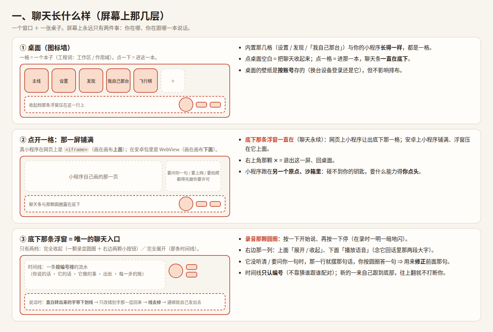
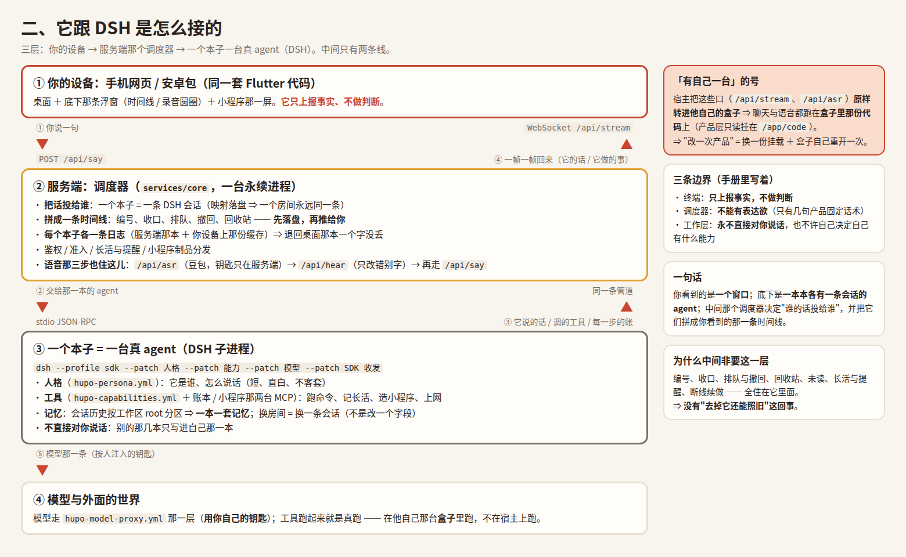

# 196 · **两张图：聊天长什么样 · 它跟 DSH 怎么接**

> 主人 2026-10-06：*「用画图的方式，告诉我，聊天的结构和 dsh 的对接是怎么样的？」*
>
> 这一篇就是那两张图（＋ 画它们的源文件）。**图里的每条事实都能在代码里指出来**
> （文件名写在图下面的"出处"里）——不是示意，是照现在的实现画的。

## 一、聊天长什么样（屏幕上那几层）



**三层，从上到下**：

| 层 | 是什么 | 出处 |
|---|---|---|
| **桌面（图标墙）** | 一格 = 一个**本子**（工程词：工作区 / 作用域）。内置那几格（设置 / 发现 /「我自己那台」）与你的小程序长得一样 | `lib/widgets/app_desktop.dart` · `lib/screens/chat_screen.dart` |
| **那一屏铺满** | 真小程序：网页上 `<iframe>`（画布**上面**）、安卓上 WebView（画布**下面**）；网页上让出底下那一格、安卓上铺满 | `lib/widgets/mini_app_host.dart` · `mini_runtime_web.dart` · `mini_frame.dart` 的 `miniAppBleedsBottom` |
| **底下那条浮窗** | **唯一的聊天入口**：收起档（一颗录音圆圈 ＋ 右边两颗小按钮）／ 全开档（那条时间线） | `lib/widgets/chat_floater.dart` · `voice_bar.dart` |

**两件容易搞错的事**（图上都标了）：

* 时间线**只认编号**（谁跟谁配对不靠猜）—— 编号由服务端发，客户端不自己数。
* 说话时那行字**先带下划线**（直白转出来的），只改错别字那一层回来才**去掉线**。

## 二、它跟 DSH 是怎么接的



**三层 ＋ 两条线**：

```
你的设备（手机网页 / 安卓包）
   │  ① POST /api/say（你说的一句）        ▲  ④ WebSocket /api/stream（一帧一帧回来）
   ▼                                       │
服务端：调度器（services/core，永续进程）      ← 一本地图 / 一条时间线 / 每本一条日志 / 语音三件
   │  ② stdio JSON-RPC                    ▲  ③ 它说的话、调的工具、每一步的账
   ▼                                       │
一个本子 = 一台真 agent（dsh 子进程）           ← 人格 / 能力 / 模型 / SDK 收发 四层 patch
   │  ⑤ 模型那一条（按人注入的钥匙）
   ▼
模型与外面的世界（工具在他自己那台盒子里真跑）
```

| 图上那一格 | 代码里在哪 |
|---|---|
| `POST /api/say` | `src/server.js`（`handleSay`）· `src/say.js` |
| `WebSocket /api/stream` | `src/server.js` 的升级那一段 · 帧名见 `docs/dev/71-MIC-ASR.md` 与契约 §二 |
| 调度器：编号 / 收口 / 排队 / 撤回 | `src/dispatcher.js` · `src/admission.js` · `src/queue.js` |
| 「一个本子 = 一条 DSH 会话」 | `src/dsh-sessions.mjs`（映射落盘）· `src/agent-runtime.js` 的 `AgentRuntime.agent()` |
| `dsh --profile sdk --patch …` | `src/agent-runtime.js`（`agentPatchArgs` / `agentArgs` —— **参数只有这一处出处**） |
| 人格 / 能力 / 模型 / SDK 四层 | `hupo-persona.yml` · `hupo-capabilities.yml` · `hupo-model-proxy.yml` · `hupo-sdk-server.yml`（都是 strict） |
| 语音三步 | `src/asr.js`（`/api/asr` → 豆包）· `src/hear.js`（`/api/hear`，只改错别字）· 再走 `/api/say` |
| 盒子那一支 | `src/server.js` 的 `proxyUpgrade`（把 `/api/stream` 原样转进他的盒子）· 产品层只读挂 `/app/code`（`scripts/build-tenant-code.sh`） |

**三条边界**（手册 `02-ARCHITECTURE.md` §1.2，图里也写了）：
终端**只上报事实、不做判断**；调度器**不能有表达欲**（只有几句产品固定话术）；
工作层**永不直接对你说话**，也不许自己决定自己有什么能力。

## 三、怎么重画（别手改 PNG）

源文件就在旁边，两张都是**一份 HTML ＋ 无头浏览器截一张图**：

```bash
cd docs/dev/196-raw
CHROME=$(ls ~/.cache/hupo-chrome/chrome/*/chrome-linux64/chrome | head -1)
"$CHROME" --headless=new --no-sandbox --disable-gpu --hide-scrollbars \
  --window-size=1500,1010 --screenshot=chat.png file://$PWD/chat.html
"$CHROME" --headless=new --no-sandbox --disable-gpu --hide-scrollbars \
  --window-size=1560,960  --screenshot=dsh.png  file://$PWD/dsh.html
```

⚠️ 改了图就**连着这一篇一起改**（数字/文件名要对得上）；`chat.html` / `dsh.html` 也在
`196-raw/` 里，随手改随手重截。
